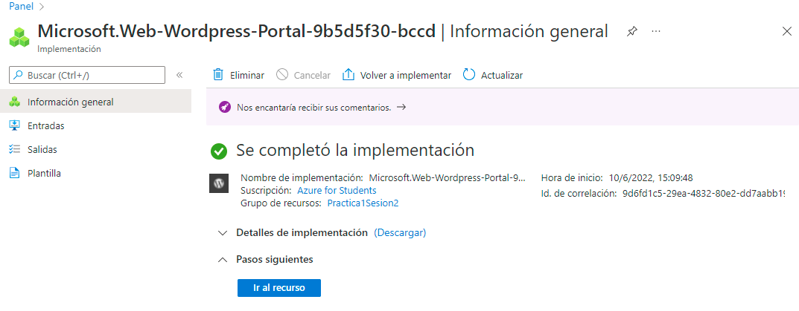
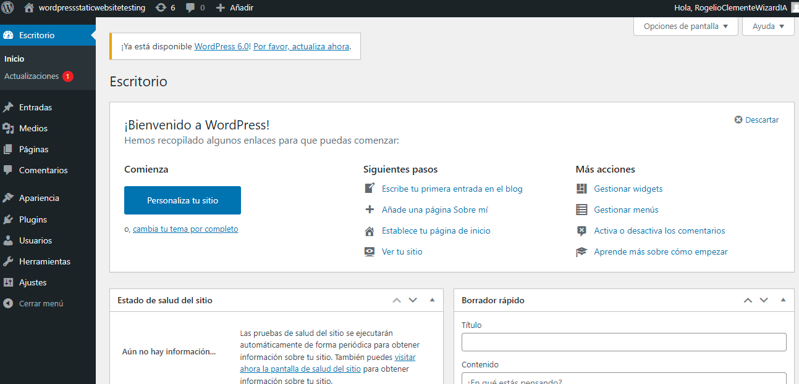

# Practica1Sesion2 

Implementación de sitio web estatico mediante el uso del servicio Azure Web Apps así como una herramienta del Azure Marketplace, WordPress.

1. Primero que nada debemos implementar una Web App y seleccionar la opción de sitio web estatico y generar el grupo de recursos.
2. Posteriormente iremos al Azure Marketplace y buscar "WordPress" y damos clic en crear.

3. Ya una vez procesado el grupo de recursos entramos al enlace del sitio web generado y la configuramos.
4. En este caso el sitio se nombro como: "wordpressstaticwebsitetesting.azurewebsites.net"
5. Gneramos un usario y una contraseña y se procede a generar el sitio web.

De esta manera ya podemos crear un sitio web estatico hospedado en Azure.

#
Autor: Rogelio Clemente Balderas
Programa Inovaccion Virtual 

Requisitos: 
- Cuenta y suscripción Azure.
- Azure Web App Services.
#